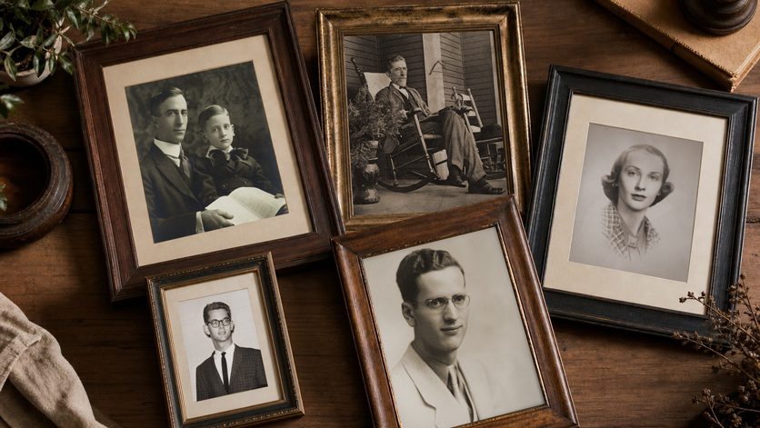
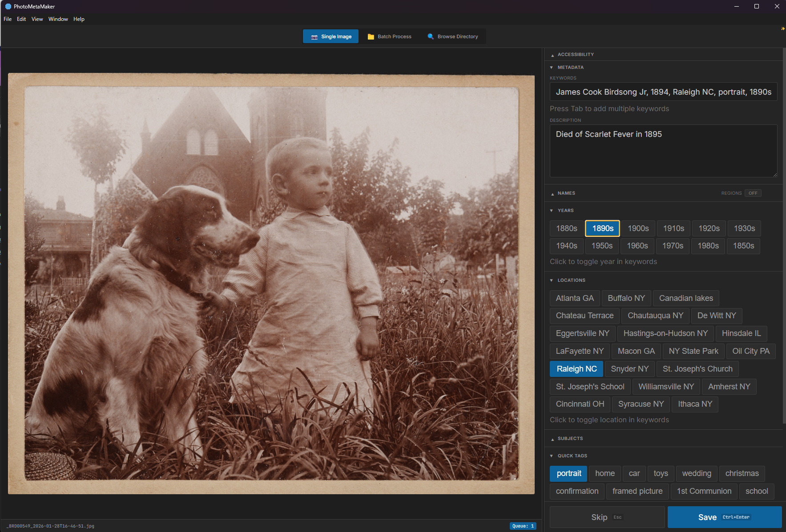
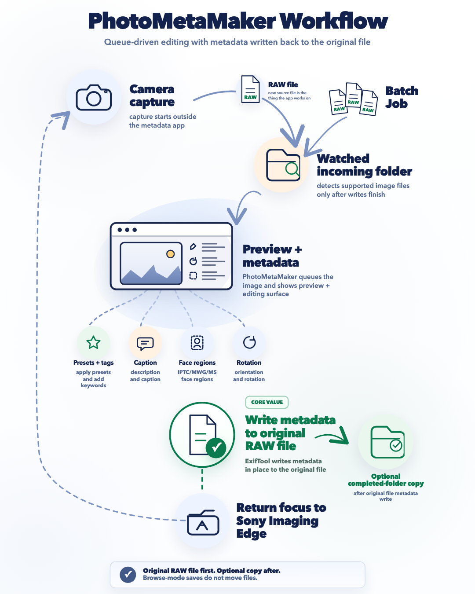
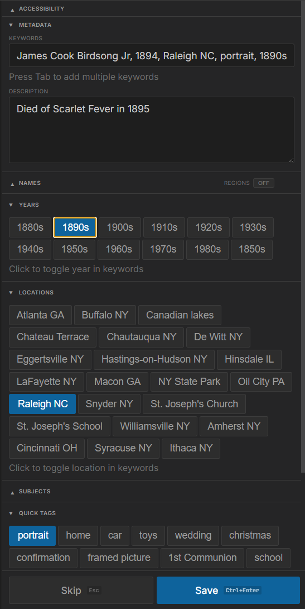

::: {.article-banner}

:::

# A custom tool for a real archive

I have family photo prints dating back to the 1850s. They are physically decaying, and the uncomfortable truth is that they will not survive indefinitely.

So I started digitizing them properly: a small home studio setup with lights and a copy stand, and a Sony camera capturing high-quality images. The capture part got efficient pretty quickly.

The real bottleneck was not scanning. It was **metadata**.

If you have ever tried to archive family photos the right way, you know what I mean. Capturing information about the photo is hard: who is in the picture, where it was, when it was taken, what event it was, relationships, condition notes, and all the tiny context that turns an image into actual history.

Doing that for thousands of photos manually is a project that can easily stall out forever.

Further my father, who is more than 80 years old now, would be the one inputting the metadata because he's the last person alive who knows anything about the photos.

So I decided to build a tool that makes metadata tagging as easy as clicking a few buttons. I created the whole tool without writing a single line of code myself and was done in a few days thanks to using a code generator!

I'm going to explain how I made it, and you can [get a copy of it from GitHub here](https://github.com/WSJUSA/PhotoMetaMaker.git).

## Why I did not just buy software

There are lots of tools that can store metadata, and lots of workflows that can eventually get it into your library.

What I could not find was a workflow designed for **high-volume, fast, no-drama tagging** that would easily add metadata to the original file.

Sounds simple but there were not any good solutions to do this.

The solution requires embedding metadata into the original photos using widely supported standards like EXIF, IPTC, and XMP, so the information travels with the photo and stays usable in tools like Lightroom or DigiKam.

Long-term, that is the whole point. If someone opens these photos in 2225, I do not want them to need my workflow, my app, or my folder structure. I want them to open the file and see the names and context right there.

## What the tool needed to do

I use a Sony camera and Sony Imaging Edge Remote for the capture step: tether the camera, shoot, and images land in a folder on my PC.

So the ideal tool looked like this:

1. Watch a folder for new images.
2. Automatically show each new photo in a simple UI.
3. Let me apply metadata using one-click preset buttons for people, places, dates, events, condition notes, and relationships.
4. Write metadata into the original file, not sidecars.
5. Optionally move the file to a Completed folder to keep the workflow clean.
6. Get out of the way and return me to capture.

The key was making tagging micro-fast. If I can tag in two or three seconds, I will actually do it. If it feels slow or fiddly, I will procrastinate, and the backlog will win.

## AI has made this so easy I could do it from my phone in the kitchen.

I actually did this project back in December when Open 4.5 came out.

This project started in an unglamorous way: I opened Grok on my phone while cooking pasta.

I described the problem in plain language and asked it to do something I have found consistently useful: interview me for product requirements so I end up with a real PRD instead of vague notes.

Fifteen minutes of back-and-forth later, still standing in the kitchen, I had a PRD that was good enough to guide the build.

This is my preferred way of working. Clarify requirements, then let the code agent run with it.

## The build

With the PRD done, it took two days to build the product, and I built it twice.

On day one, I generated the PRD, turned it into technical requirements for an MVP and a fuller app, ran the plan through a second model for review, and had an implementation agent generate the first version.

The MVP goal was narrow: prove that folder watching and metadata writes worked reliably. No polish, no extras.

On day two, I rebuilt it as a real tool. The initial UI was terrible. I wanted something clean like Photoshop. The solution selected was Electron, and the app was rebuilt quickly with a much better UX.

Amazing! And I didn't touch a single line of code. It just worked.

## What shipped

The current app is:

- Electron-based, with a clean minimal UI
- Watches a folder for new photos
- Auto-displays a preview
- Uses an editable JSON config for preset buttons
- Applies metadata fields such as keywords, caption, and description
- Writes in-place to the original file
- Moves files to a Completed folder after tagging
- Refocuses the capture workflow
- Includes a standalone batch mode for existing photos

## Why presets beat voice

I originally thought voice tagging might be the magic trick.

But in practice, presets are super fast:

- With 10 to 20 presets for locations, common names, and common events, I could cover most of my tagging needs.
- Tagging became one to four clicks.
- Time per photo dropped to a few seconds.
- Accuracy became effectively perfect, with no misheard names or ambient-noise problems.

It also removes cognitive load. This was especially valuable for my father so he didn't have to write descriptions. He could confirm known facts quickly, which is exactly what high-volume archival work needs.

## The outcome

The total active development time was around five hours spread over a weekend, and it produced something practical and durable:

- A workflow that makes digitizing family prints feel achievable
- Metadata embedded into files in standard formats
- A UI I can actually use for long sessions

And the part that keeps sticking with me is not "I built a startup."

It is that reliable AI coding changed what I consider feasible as a single person. Problems that would have lived forever as a spreadsheet of "someday I will build this" can now become real tools: built fast, iterated quickly, and shaped exactly to the workflow you actually live with.

## Why this matters

This is what I mean when I say code generation has become real: not that every person becomes a unicorn founder, but that we can finally build high-quality custom tools for real-life problems, especially the personal ones where no product is quite right.
