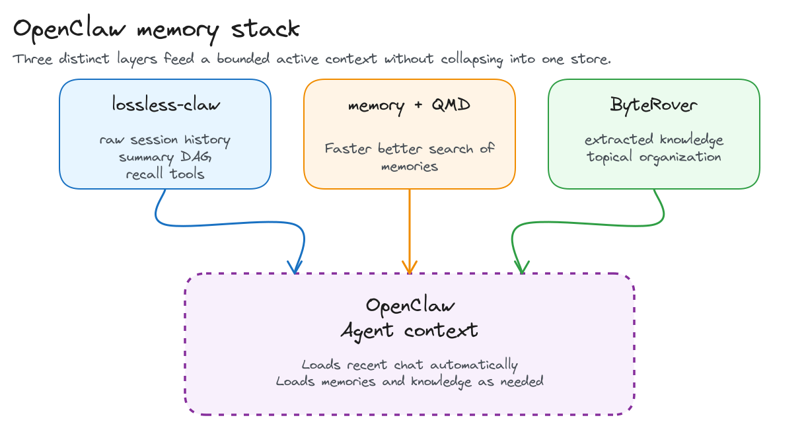
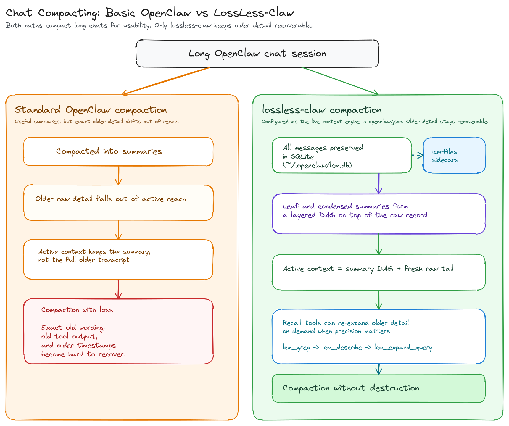
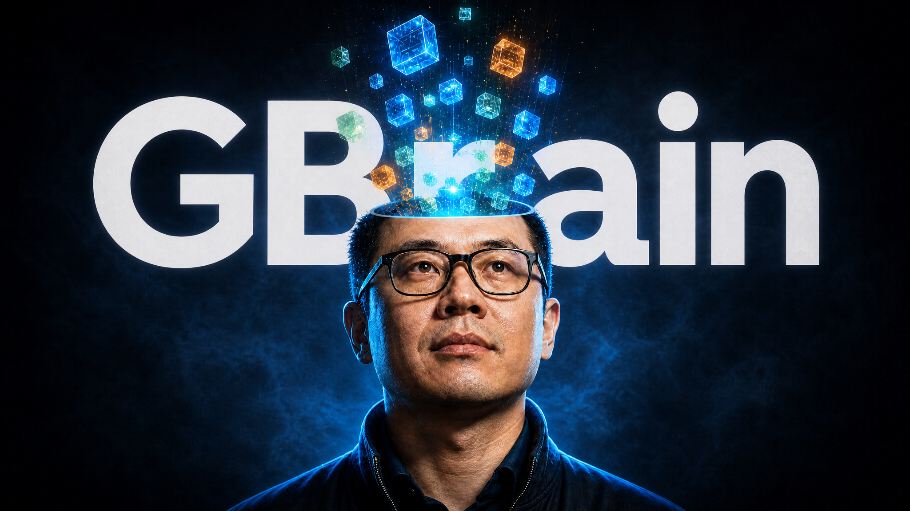

::: {.article-banner}

:::

If you are building on OpenClaw, context and memory can be confusing. This article offers a rich memory setup that will improve agent performance and yet is easy to install.

My OpenClaw is modified with 3 context /memory upgrades, each providing a different enhancement. Here are the 3 key updates and why they matter:

- [lossless-claw](https://openclawdir.com/plugins/lossless-claw-a7dqhn) for exact conversation history and auditable recall
- memory with [QMD](https://github.com/tobi/qmd) for local memory-file search and retrieval
- [ByteRover](https://docs.byterover.dev/) for curated durable knowledge

In this OpenClaw deployment, those three parts work together to separate raw history, working memory, and institutional knowledge instead of forcing one layer to do every job.



I will explain why I'm using each upgrade and how to install it into your OpenClaw.

## Lossless-claw for raw source of truth

The first upgrade is [`lossless-claw`](https://openclawdir.com/plugins/lossless-claw-a7dqhn) because default OpenClaw behavior becomes destructive once a session gets long: older messages are compacted into summaries and the raw detail falls out of active context just when exact specifics may still matter. `lossless-claw` changes that tradeoff by storing every message in SQLite, building layered summaries as a DAG, and keeping pointers back to the underlying detail so older context can be re-expanded later instead of being irreversibly discarded. In my own setup, that archive has grown to about 2.0 GB after roughly two months of active use, almost all of it in `lcm.db`, which has been a modest storage cost for preserving a non-destructive raw history layer.



### Simple setup instructions for Lossless Claw

[`lossless-claw`](https://openclawdir.com/plugins/lossless-claw-a7dqhn) is available as a plugin and is very easy to install using the plugin installer that comes with OpenClaw. The source repo is also available on [GitHub](https://github.com/martian-engineering/lossless-claw).

```bash
openclaw plugins install @martian-engineering/lossless-claw
openclaw plugins inspect lossless-claw --json
```

Then make sure OpenClaw uses it as the context engine in `~/.openclaw/openclaw.json`. Keep its state in `~/.openclaw/lcm.db` and `~/.openclaw/lcm-files/`.

```json
{
  "plugins": {
    "slots": {
      "contextEngine": "lossless-claw"
    },
    "entries": {
      "lossless-claw": {
        "enabled": true
      }
    }
  }
}
```

From there, you can tune `lossless-claw` per agent and per session type. Some agents should stay fully stateful so their history is preserved normally, some can be marked stateless so OpenClaw treats them as temporary working sessions, and some background sessions such as cron or heartbeat can be ignored entirely. If you are not sure which pattern fits each of your agents, ask your OpenClaw agent to recommend a `lossless-claw` layout for your specific agent roster.

## QMD for memory search

Adding [QMD](https://github.com/tobi/qmd) to OpenClaw's memory system helps it find and reuse its saved memory faster and more accurately.

QMD includes search technology BM25 which gives OpenClaw a stronger text-search layer, so it can rank the most relevant saved notes higher instead of just matching words more crudely.

That makes memory retrieval a quicker, cheaper way to reach key historical records, while `lossless-claw` remains the higher-fidelity layer when exact recall is needed.

In this stack, QMD complements `lossless-claw` instead of replacing it. `lossless-claw` remains the exact prior-conversation evidence layer, while QMD is the retrieval layer over curated memory files like `MEMORY.md` and `memory/**/*.md`.

### Simple setup instructions for QMD

Install QMD first:

```bash
npm install -g @tobilu/qmd
brew install sqlite
~/.npm-global/bin/qmd --version
```

Then tell OpenClaw to use QMD as the memory backend in `~/.openclaw/openclaw.json`:

```json
{
  "memory": {
    "backend": "qmd",
    "qmd": {
      "command": "/Users/superbirdnine/.npm-global/bin/qmd",
      "searchMode": "search",
      "includeDefaultMemory": true
    }
  }
}
```

That configuration keeps QMD agent-scoped by default. `includeDefaultMemory` tells OpenClaw to index each agent's own `MEMORY.md` and `memory/**/*.md`, `searchMode: "search"` keeps normal recall lightweight with BM25/full-text search, and if QMD is unavailable OpenClaw can fall back to its builtin memory engine. QMD's per-agent cache and index can live under `~/.openclaw/agents/<agent>/qmd/`.

## ByteRover for topical memory

The last enhancement I added to my OpenClaw is topical memory. Instead of organizing everything around sessions, transcripts, or time-based summaries, the third layer is organized around reusable ideas, patterns, and facts.

I use [ByteRover](https://docs.byterover.dev/) to build a knowledge base around the ideas, patterns, and lessons that emerge from all the work I process through OpenClaw agents.

Base OpenClaw gives you conversation history and per-agent memory, but it does not by itself give you a strong historic knowledge layer for cross-session knowledge that has already been judged worth keeping. Without that extra layer, the same lessons have to be rediscovered, rewritten into agent memory, or pulled back out of old chats over and over again.

There are several other efforts aimed at a similar benefit, from Andrej Karpathy's [LLM Wiki gist](https://gist.github.com/karpathy/442a6bf555914893e9891c11519de94f) to Garry Tan's [`gbrain`](https://github.com/garrytan/gbrain) and its [launch post on X](https://x.com/garrytan/status/2042497872114090069). They are all reaching toward some version of a knowledge graph or topical knowledge layer that is easy for the model to query over time, while also preserving relationships between ideas so the agent can build deeper awareness around a subject.

That is the gap ByteRover fills in this stack. It gives OpenClaw a dedicated place to promote useful patterns, decisions, and operating facts out of temporary working memory and into a reusable knowledge base.

### Here is how to install ByteRover for OpenClaw.

Start with ByteRover's OpenClaw setup script:

```bash
curl -fsSL https://byterover.dev/openclaw-setup.sh | sh
```

The installer checks the local prerequisites, installs `brv` if it is missing, registers the OpenClaw connector, installs the ByteRover skill, backs up the OpenClaw config, and then asks which integration features to enable.

When the installer asks if you want to install the context engine, reply No. That would overwrite the lossless-claw context configuration.

When the installer asks about Automatic Memory Flush: Yes.  This will enable capture of topics from all sessions.

The setup also updates the workspace instruction files so agents know ByteRover is available. In `AGENTS.md`, the installer appends a knowledge protocol block like this:

```markdown
## Knowledge Protocol (ByteRover)
This agent uses ByteRover (`brv`) as its long-term structured memory.
You MUST use this for gathering contexts before any work. This is a Knowledge management for AI agents. Use `brv` to store and retrieve project patterns, decisions, and architectural rules in .brv/context-tree.
1.  **Start:** Before answering questions, run `<brv-path> query "<topic>"` to load existing patterns.
2.  **Finish:** After completing a task, run `<brv-path> curate "<summary>"` to save knowledge.
3.  **Don't Guess:** If you don't know anything, query it first.
4.  **Response Format:** When using knowledge, optionally cite it or mention storage:
    - "Based on brv contexts at `.brv/context-trees/...` and my research..."
    - "I also stored successfully knowledge to brv context-tree."
```

In `TOOLS.md`, it appends the short command reference agents can use when they need ByteRover:

```markdown
## ByteRover (Memory)
- **Query:** `<brv-path> query "auth patterns"` (Check existing knowledge)
- **Curate:** `<brv-path> curate "Auth uses JWT in cookies"` (Save new knowledge)
- **Sync:** `<brv-path> pull` / `<brv-path> push` (Sync with team - requires login)
```

You can see these instructions are pretty directive. You may wish to tone them back a little to make the usage a little more optional to your agent, but these will get you started.

After the OpenClaw integration is installed, connect ByteRover to the model provider used by OpenClaw.

Here is an example for a Codex/OpenAI setup using GPT-5.5:

```bash
brv providers connect openai --oauth --model gpt-5.5
```

Once that provider setup is in place, normal OpenClaw sessions can feed ByteRover through the installed auto-flow, and agents can search ByteRover whenever durable knowledge is useful. You can also ask your agent to search ByteRover for you.

The storage split is the important part:

- `~/.openclaw/lcm.db` for raw conversation truth
- each agent's `MEMORY.md` and `memory/` for local working memory
- [ByteRover](https://docs.byterover.dev/) for curated durable knowledge

## Aligned to Industry Memory Trends

Over the last two months, top AI engineers and leading research efforts have advanced solutions to the AI memory problem that closely resemble the three-tier architecture proposed in the first half of this essay. They have often advanced similar structural ideas: layered memory, differentiated tiers of recovery, and selective context reseeding. We can easily see common areas of overlap in the work of Andrej Karpathy and Garry Tan, in the [xMemory paper](https://arxiv.org/abs/2602.02007), and in the [Claude Code](https://www.anthropic.com/product/claude-code) source code leak and the analysis that followed.

### Andrej Karpathy's LLM wiki

On April 4, 2026, Andrej Karpathy published his [`LLM Wiki` gist](https://gist.github.com/karpathy/442a6bf555914893e9891c11519de94f) as a pattern for building personal knowledge bases with LLMs. His core complaint was that standard RAG keeps forcing the model to rediscover the same knowledge from scratch instead of accumulating understanding over time. The wiki idea answers that by having the model compile source material into a persistent, interlinked knowledge layer that can be updated and reused. That maps cleanly to the durable knowledge tier in this OpenClaw setup.

### Garry Tan's gbrain

Garry Tan's [`gbrain`](https://github.com/garrytan/gbrain), which he also introduced in a [post on X](https://x.com/garrytan/status/2042497872114090069), pushes in a similar direction by treating a repository of notes and files as a real operational memory surface for agents. That overlaps with the OpenClaw approach because both systems assume memory should be inspectable, editable, and available across sessions. Where the three tier model goes further is by separating exact transcript truth from working notes and durable promoted knowledge. The shared theme is that memory becomes more useful when it is organized into distinct roles instead of one undifferentiated bucket.



### Michael Chomsky's comments

Michael Chomsky's [April 12, 2026 post](https://x.com/i/status/2043369126631207096) makes a narrower but still important point: file based memory is a strong storage interface because it is readable, versioned, diffable, and greppable, but that alone does not solve the harder memory problems. He specifically pushes on compaction, temporal validity, proactive injection, and relationship modeling as the real design pressure. That aligns closely with the OpenClaw three tier architecture, which separates exact transcript truth, working notes, and durable promoted knowledge instead of treating files alone as the full memory system.

### Claude Code's accidental source release

The Claude Code accidental source release matters because the public [memory docs](https://code.claude.com/docs/en/memory), [sub-agents docs](https://code.claude.com/docs/en/sub-agents), and outside [leak analysis](https://www.deeplearning.ai/the-batch/claude-codes-source-code-leaked-exposing-potential-future-features-kairos-and-autodream) together describe a fairly explicit memory strategy, not just a vague similarity. Claude Code starts fresh sessions instead of replaying everything, loads concise `CLAUDE.md` instructions hierarchically, keeps subagents in separate context windows, limits auto-memory at load time, and appears to use multiple compaction passes rather than one blunt summarize-everything fallback. The better analyses also suggest that Claude Code keeps the full history on hand without dumping all of it back into the model every time. It can save the past while only pulling in the parts that matter for the current step. That is very close to the same family of design decisions behind the OpenClaw stack: treat context as scarce working memory, load selectively, compact aggressively, and verify against current source of truth instead of trusting memory alone.

### The xMemory paper

The [xMemory paper](https://arxiv.org/abs/2602.02007) makes the same case from a research angle by treating agent memory as a structured system with hierarchical retrieval, top-down expansion, redundancy control, and pruning instead of flat recall. That lines up with the core logic of the three tier model, where different layers solve different memory jobs and not every remembered thing should be loaded the same way. The overlap is less about tool names and more about lifecycle discipline. Serious memory systems are converging on structure, selection, and compaction.

## Closing

Taken together we can see the connection between these examples and the three tier solution for OpenClaw.. There is a broader industry move toward layered memory systems that preserve truth, restore useful context, and promote durable knowledge without collapsing those jobs into one surface. If you have questions about using OpenClaw this way, contact me and I am happy to help.
